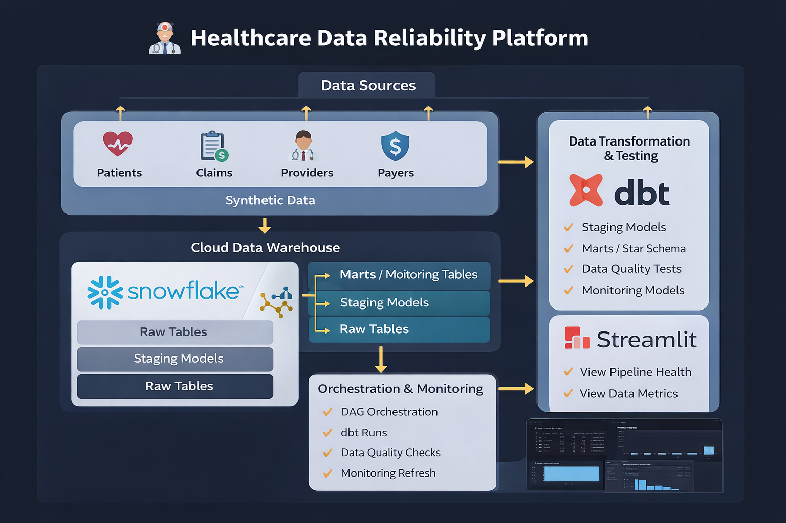
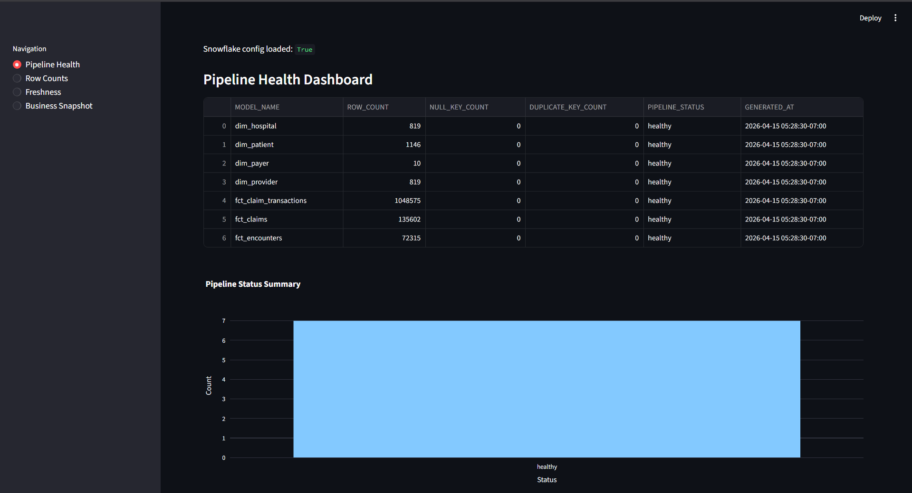
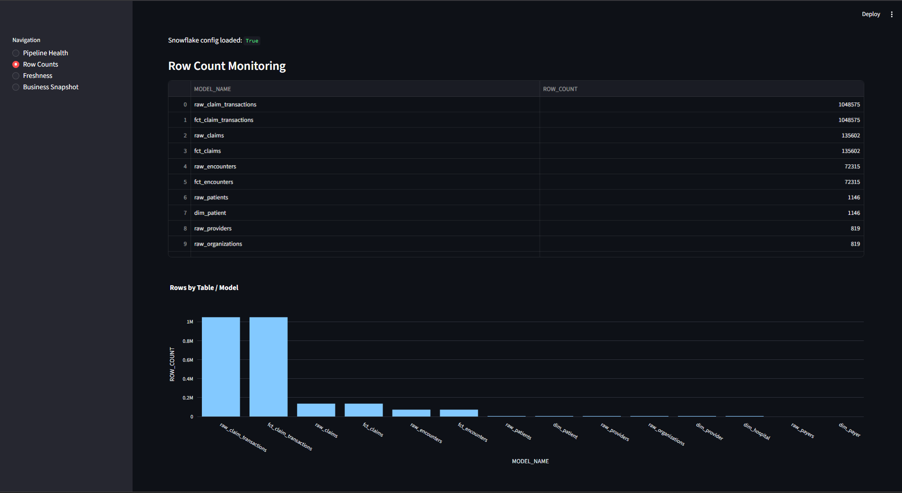
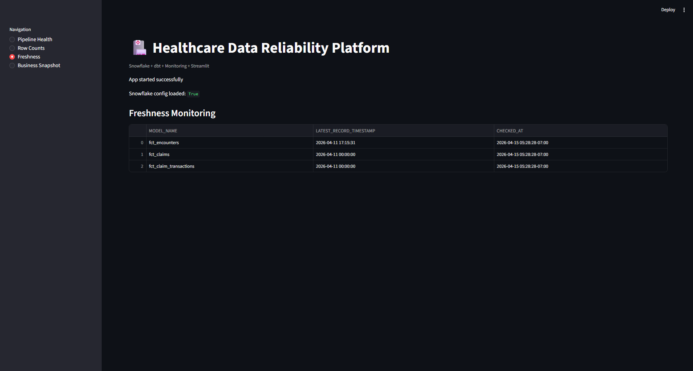
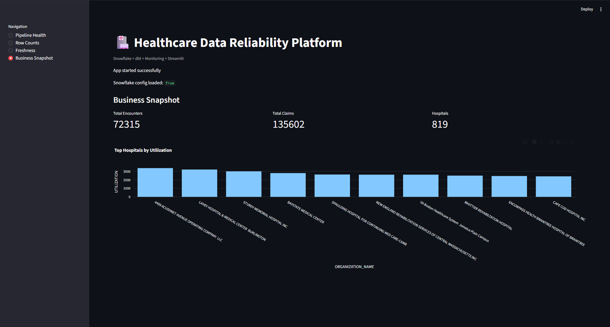

# Healthcare Data Reliability Platform

[](https://python.org)
[](https://snowflake.com)
[](https://getdbt.com)
[](https://airflow.apache.org)
[](https://streamlit.io)
[](#)
[](#)

An end-to-end modern data engineering project built to simulate how healthcare organizations create trusted analytics systems. This platform ingests synthetic healthcare operational data, transforms it into analytics-ready warehouse models, applies automated quality checks, monitors pipeline health, and exposes business insights through an interactive dashboard.

🔗 **[Live Streamlit Dashboard](https://healthcare-data-reliability-platform-mafrlu36bzomfohawzgjci.streamlit.app/)**

---

## What Problem This Solves

Healthcare data is often fragmented, delayed, inconsistent, and difficult to trust. Analysts spend more time questioning whether the numbers are right than actually using them.

This platform solves that by building a production-style reliability layer on top of raw healthcare data — clean ingestion, warehouse modeling, automated transformation pipelines, quality testing, freshness monitoring, and business visibility. The result is data that downstream teams can trust without manual verification.

---

## Architecture



**Data flow:**
```
Synthea Synthetic Healthcare Data (Patients, Claims, Providers, Payers)
        ↓
Raw Layer — Snowflake (RAW schema)
        ↓
Staging Models — dbt (STAGING schema, standardized + cleaned)
        ↓
Marts Layer — dbt (MARTS schema, star schema: facts + dimensions)
        ↓
Monitoring Models — row counts, freshness, quality metrics, pipeline health
        ↓
Airflow DAG Orchestration — daily scheduled refresh
        ↓
Streamlit Dashboard — live pipeline observability + business KPIs
```

---

## Live Dashboard Screenshots

**Pipeline Health — model-level quality checks, null counts, duplicate detection**



**Row Count Monitoring — raw vs mart row parity validation across all models**



**Freshness Monitoring — latest record timestamps vs expected refresh cadence**



**Business Snapshot — executive KPIs: encounters, claims, hospital utilization**



---

## Data Scale

| Table | Row Count |
|---|---|
| raw_claim_transactions / fct_claim_transactions | 1,048,575 |
| raw_claims / fct_claims | 135,602 |
| raw_encounters / fct_encounters | 72,315 |
| raw_patients / dim_patient | 1,146 |
| raw_providers / dim_provider | 819 |
| raw_organizations / dim_hospital | 819 |
| raw_payers / dim_payer | 10 |

All 7 models pass pipeline health checks with 0 null keys, 0 duplicate keys, status: **healthy**.

---

## Snowflake Warehouse Design

```
HEALTHCARE_RELIABILITY_DB
├── RAW              # Source-faithful tables loaded from Synthea
│   ├── raw_patients
│   ├── raw_encounters
│   ├── raw_claims
│   ├── raw_claim_transactions
│   ├── raw_providers
│   ├── raw_organizations
│   └── raw_payers
├── STAGING          # dbt staging models — cleaned, typed, renamed
└── MARTS            # Star schema — analytics-ready
    ├── dim_patient
    ├── dim_provider
    ├── dim_hospital
    ├── dim_payer
    ├── fct_encounters
    ├── fct_claims
    └── fct_claim_transactions
```

---

## dbt Transformation Layer

**Staging models handle:**
- Standardized column naming conventions
- Type casting and null handling
- Deduplication logic
- Clean column mapping from raw sources

**Mart models implement:**
- Star schema dimensional modeling
- Fact-to-dimension relationships
- Analytics-ready aggregations

**Automated dbt tests across all models:**
- `unique` — primary key uniqueness enforced
- `not_null` — critical fields cannot be null
- `relationships` — foreign key integrity validated
- Source consistency checks

---

## Monitoring Layer

Four custom monitoring models built in dbt simulate production data observability:

| Model | What It Tracks |
|---|---|
| `pipeline_health_dashboard` | Row count, null key count, duplicate key count, pass/fail status per model |
| `row_count_monitoring` | Row counts at raw and mart layers — validates no silent data loss |
| `freshness_monitoring` | Latest record timestamp vs expected refresh time |
| `data_quality_metrics` | Aggregate quality scoring across the warehouse |

---

## Airflow Orchestration

Daily DAG orchestrating the full warehouse refresh:

```
validate_raw_layer
      ↓
run_dbt_models
      ↓
run_dbt_tests
      ↓
refresh_monitoring_models
```

---

## Business Questions This System Answers

**Operational**
- How many patient encounters occurred across providers?
- Which hospitals show highest utilization rates?
- What encounter types are trending up or down?

**Financial**
- Total claims volume and outstanding balances
- Covered vs uncovered cost breakdown by payer
- Payer performance comparison

**Reliability**
- Did row counts drop unexpectedly between pipeline runs?
- Are duplicate IDs appearing in fact tables?
- Is data fresh within the expected SLA window?

---

## Tech Stack

| Layer | Tool |
|---|---|
| Cloud Warehouse | Snowflake |
| Transformation & Testing | dbt |
| Orchestration | Apache Airflow |
| Dashboard | Streamlit |
| Language | Python |
| Source Data | Synthea synthetic healthcare datasets |
| Version Control | GitHub |

---

## Repository Structure

```
Healthcare-Data-Reliability-Platform/
├── airflow/
│   └── dags/                  # Airflow DAG definitions
├── dbt_project/
│   ├── models/
│   │   ├── staging/           # Cleaned source models
│   │   ├── marts/             # Star schema — facts and dimensions
│   │   └── monitoring/        # Pipeline health and freshness models
│   ├── tests/                 # Custom data quality tests
│   └── dbt_project.yml
├── streamlit_app/             # Dashboard application
├── sql/                       # Raw SQL utilities
├── scripts/                   # Data loading scripts
├── docs/                      # Architecture diagrams and screenshots
└── README.md
```

---

## Setup

**Prerequisites**
```
Python 3.9+
Snowflake account
dbt-snowflake
Apache Airflow 2.x
```

**Install and run**
```bash
git clone https://github.com/mukuldesai/Healthcare-Data-Reliability-Platform
cd Healthcare-Data-Reliability-Platform
pip install -r requirements.txt
cp .env.example .env           # Add Snowflake credentials

# Run dbt models
cd dbt_project
dbt deps
dbt run
dbt test

# Launch Streamlit dashboard
streamlit run streamlit_app/app.py
```

---

## Future Enhancements

- Automated Slack/email alerts on pipeline failures
- Anomaly detection on row count deviations
- CI/CD deployment pipeline via GitHub Actions
- Role-based dashboard access control
- Integration with real CMS public datasets
- Cloud cost optimization monitoring

---

## Author

**Mukul Desai** — Data Engineer

[](https://linkedin.com/in/mukuldesai)
[](https://mukuldesai.vercel.app)
[](https://github.com/mukuldesai)
